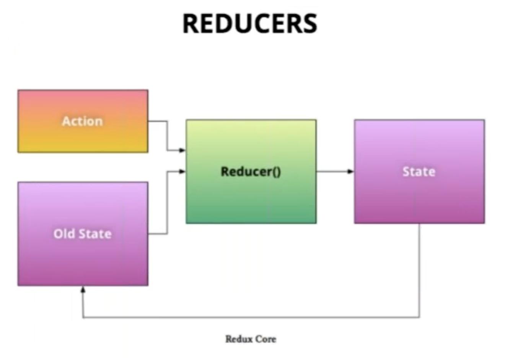

El patron de arquitectura de manejo de estado, el flujo de datos de que maneja redux y sus conceptos principales(actions, reducers, store, view). 

Accion: Es lo que se e quiere hacer con un estado.
Reducer: Una funcion que solo recibe un estado y una accion y que devuelve un nuevo estado.

Store: El estado de la aplicacion  esta almacenado en un àrbol guardado en un ùnico Store

Principios basicos: 
1. una unica fuente de la verdad
2. El estado es de solo lectura
3. Los cambios son hechos por funciones puras